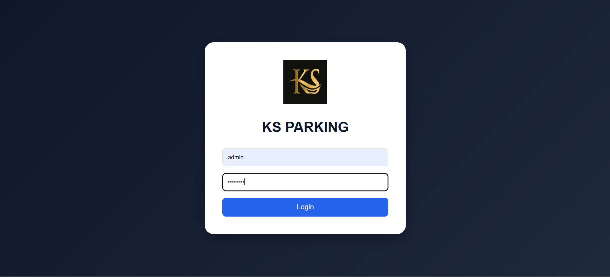
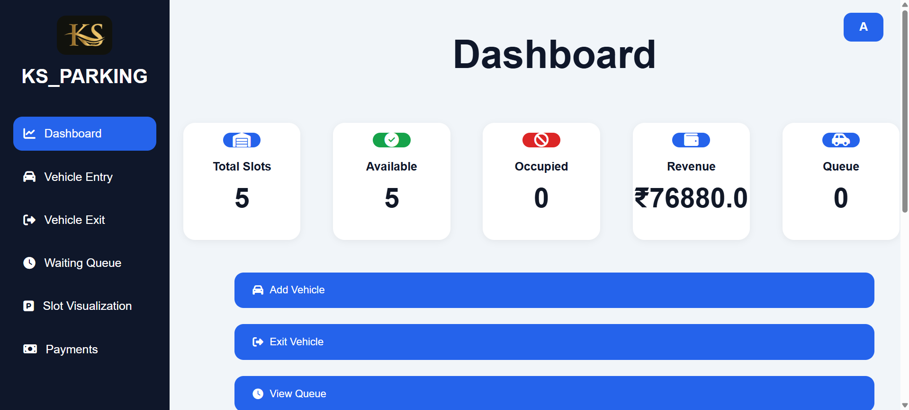
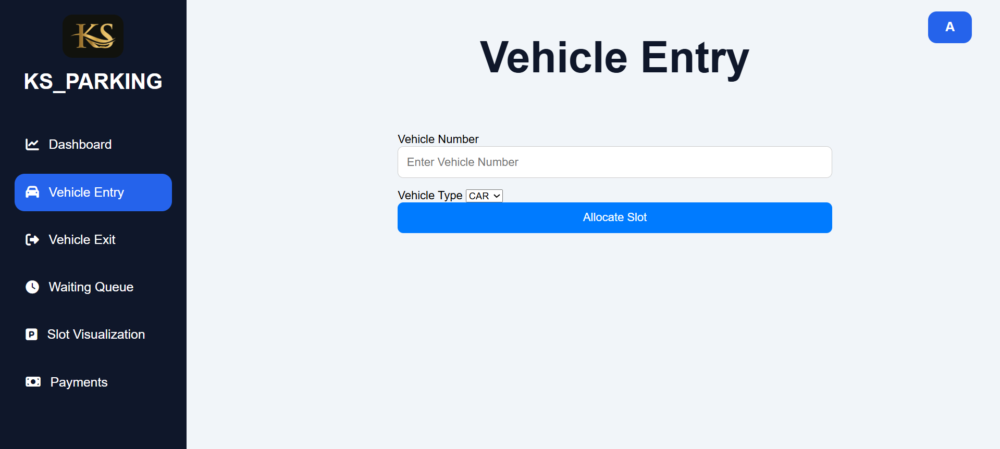

# Smart Parking Management System

A web-based Smart Parking Management System developed using Spring Boot, Thymeleaf, MySQL, HTML, CSS, and JavaScript. The system helps manage vehicle parking, slot allocation, vehicle entry/exit, payments, waiting queue management, and email receipt generation.

---

## Features

* Secure Admin Login
* Vehicle Entry Management
* Vehicle Exit Management
* Automatic Slot Allocation
* Waiting Queue Management
* Dashboard Analytics
* Payment Tracking
* Email Receipt Generation
* Slot Visualization
* Revenue Monitoring
* Recent Activity Tracking

---

## Technologies Used

* Java 21
* Spring Boot
* Spring MVC
* Spring Data JPA
* Thymeleaf
* MySQL
* HTML5
* CSS3
* JavaScript
* Maven

---

## Project Modules

### Admin Login

Provides secure access to the parking management system.

### Dashboard

Displays:

* Total Slots
* Available Slots
* Occupied Slots
* Queue Count
* Total Revenue
* Recent Activities

### Vehicle Entry

Registers incoming vehicles and allocates available parking slots automatically.

### Vehicle Exit

Calculates parking fees, processes payment details, and frees occupied slots.

### Waiting Queue

Stores vehicles when parking slots are unavailable and automatically allocates slots when they become free.

### Payments

Maintains payment records including:

* Vehicle Number
* Payment Method
* Amount Paid
* Status
* Date and Time

### Slot Visualization

Displays real-time parking slot status:

* FREE
* OCCUPIED

### Email Receipt

Automatically sends a parking receipt to the customer upon successful vehicle exit.

---

## Setup Instructions

### Clone Repository

```bash
git clone https://github.com/YOUR_USERNAME/SmartParkingSystem.git
```

### Database Configuration

Create a MySQL database:

```sql
CREATE DATABASE smart_parking_system;
```

Update the database configuration in:

```text
src/main/resources/application.properties
```

Example:

```properties
spring.datasource.url=jdbc:mysql://localhost:3306/smart_parking_system
spring.datasource.username=your_username
spring.datasource.password=${DB_PASSWORD}
```

Set the environment variable:

```powershell
setx DB_PASSWORD "your_database_password"
```

Restart VS Code after setting the variable.

### Email Configuration

Set the Gmail environment variables:

```powershell
setx KS_EMAIL "your_email@gmail.com"
setx KS_EMAIL_PASSWORD "your_gmail_app_password"
```

Restart VS Code after setting the variables.

---

## Screenshots

### Login Page



### Dashboard



### Vehicle Entry




---

## Future Enhancements

* QR Code Based Parking
* Online Payment Gateway Integration
* Vehicle Number Plate Recognition
* Mobile Application Support
* Multi-Level Parking Management
* Parking Reservation System

---

## Author

**Vishy**

Smart Parking Management System Project

